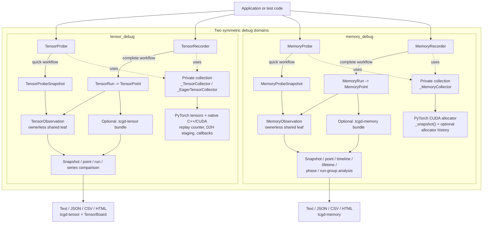

# torch-cudagraph-debug

Focused debugging tools for PyTorch CUDA Graphs:

- `tensor_debug` inserts native tensor probes and builds persisted eager or
  CUDA Graph runs for offline differential analysis.
- `memory_debug` records allocator snapshots and analyzes default and
  non-default pools, including CUDA Graph private pools.

Both domains expose a low-ceremony `Probe -> ProbeSnapshot` workflow for local
inspection and two-point comparison. Complete experiments use `Recorder -> Run
-> Point -> Observation` for named points, persistence, timelines, and cross-run
analysis. Probe and Recorder are sibling clients of private, domain-specific
collection code; both workflows use the same ownerless Observation leaf type.

The package targets Linux, Python 3.10+, and CUDA-enabled PyTorch 2.6+. Source
builds use the PyTorch and CUDA toolchain in the target environment.

## Architecture at a Glance



The same vocabulary is used in both domains. `Probe` is the quick, bundle-free
workflow; `Recorder` owns a complete named run and optional persistence. Both
reuse private collection code and converge on ownerless `Observation` leaves,
while snapshot and point comparisons remain sibling result types. See the
[detailed architecture](docs/architecture.md) for ownership and lifecycle
rules.

## Install

Source installation currently builds the native tensor extension for the whole
package. Install CUDA-enabled PyTorch, a compatible CUDA development toolkit,
and a C++17 compiler first. Because the extension builds against the installed
PyTorch, prepare the declared build backend and then build without isolation:

```bash
python -m pip install --upgrade "setuptools>=77.0.3" wheel
python -m pip install --no-build-isolation .
```

To install the repository version:

```bash
python -m pip install --no-build-isolation \
  "git+https://github.com/buptzyb/torch-cudagraph-debug.git@main"
```

Tensor probes require the compiled native extension at runtime. Memory debugging
is implemented in Python, but there is currently no memory-only source
installation mode.

## Tensor Quick Start

Insert a probe at intermediate tensors inside a captured dataflow. This example
uses the recommended `RecordAction` action to inspect two hidden states without
changing the graph's output:

```python
import torch

from torch_cudagraph_debug.tensor_debug import RecordAction, TensorProbe

static_x = torch.arange(8, device="cuda", dtype=torch.float32)
probe = TensorProbe("hidden", [RecordAction()])

graph = torch.cuda.CUDAGraph()
with torch.cuda.graph(graph):
    # Each probe call records one intermediate tensor in this dataflow.
    first_hidden = probe(static_x * 2)
    second_hidden = probe(torch.relu(first_hidden - 5))
    output = second_hidden.square()

replay_stream = torch.cuda.current_stream()
graph.replay()

# The query waits only for the stream that launched this replay.
# One snapshot contains every capture-time invocation in order.
snapshot = probe.snapshot(synchronize=replay_stream)
for observation in snapshot.observations:
    print(
        f"replay={snapshot.replay_index} "
        f"invocation={observation.invocation_index}: {observation.tensor()}"
    )
# snapshot() already synchronized replay_stream, so cleanup needs no second wait.
probe.close(synchronize=False)
```

Output:

```text
replay=1 invocation=0: tensor([ 0.,  2.,  4.,  6.,  8., 10., 12., 14.])
replay=1 invocation=1: tensor([0., 0., 0., 1., 3., 5., 7., 9.])
```

`RecordAction` is the recommended starting point: query the latest replay
snapshot in Python without a CUDA host callback. Pass the replay stream to
`snapshot()` to avoid a device-wide synchronization. The probe returns its
input unchanged, so it does not alter the model's dataflow.
It still enqueues a device-to-host copy into pinned staging memory for every
captured invocation, so keep probes limited to tensors needed for debugging.

The graph above captures one sequential dataflow while the same probe observes
two intermediate tensors. Each probe call creates one invocation slot, and
`snapshot()` returns all latest values as one aggregate result. The probe's GPU
counter advances once per graph replay, so the snapshot reports one 1-based
`replay_index` shared by every observation. Query methods use a safe
device-wide synchronization by default; pass the replay stream for the
recommended stream-scoped behavior, or `synchronize=False` after arranging
ordering yourself.

Other actions are available when needed. Both unavoidably add CUDA host-callback
overhead and can create a GPU bubble, so use them only at small, targeted probe
sites. Cost grows with payload and depends on dtype, formatting/comparison work,
host CPU, and runtime; there is no portable byte threshold. For large tensors,
prefer `RecordAction` plus offline inspection or comparison:

- `PrintAction` prints replay values immediately from a native host callback.
- `CheckAction` checks replay values against expected CPU tensors.

Multiple actions can be combined on one probe.

Continue with the [Tensor Debug guide](docs/tensor_debug.md), the
[example learning path](examples/tensor_debug/README.md), or the
[API reference](docs/api.md#tensor-debug).

For a one-off eager-to-CUDA-Graph check, collect independent Probe snapshots and
call `compare_snapshots()`. Use `TensorRecorder` when the investigation spans
multiple points, processes, code revisions, or devices and needs persisted named
observations in `.tcgd-tensor` bundles. `compare_points()` locates the first divergent probe,
`compare_runs()` aligns same-labeled points, and `compare_point_series()` checks one
reference against every replay. Full payloads provide numerical error metrics;
summary payloads provide compact exact-digest evidence and explicitly report
inconclusive allclose results when raw values are unavailable.

See the [eager-vs-CUDA-Graph example]
(examples/tensor_debug/eager_vs_cuda_graph.py) for the end-to-end workflow.
The [standalone snapshot example](examples/tensor_debug/snapshot_comparison.py)
shows the bundle-free alternative.

## Memory Quick Start

Take snapshots around CUDA Graph capture, then compare allocator state to see
graph-private pool growth. This lightweight Probe workflow does not require
PyTorch allocator history:

```python
import torch

from torch_cudagraph_debug.memory_debug import MemoryProbe

probe = MemoryProbe(name="graph-capture")
before_capture = probe.snapshot()

graph = torch.cuda.CUDAGraph()
with torch.cuda.graph(graph):
    # This allocation belongs to the graph's private pool.
    graph_state = torch.empty(
        16 * 1024 * 1024,
        dtype=torch.uint8,
        device="cuda",
    )
    graph_state.fill_(1)

after_capture = probe.snapshot()
growth = probe.compare(before_capture, after_capture)
print(growth.to_text(include_unchanged=False))
```

Output from the tested run:

```text
Memory comparison 'graph-capture@snapshot-0' -> 'graph-capture@snapshot-1' (same probe)
  allocator totals:
    total[all]
      allocated: 0 B -> 16.00 MiB (delta +16.00 MiB), reserved: 0 B -> 18.00 MiB (delta +18.00 MiB)
      active: 0 B -> 16.00 MiB (delta +16.00 MiB), requested: 0 B -> 16.00 MiB (delta +16.00 MiB)
    total[default]
      allocated: 0 B -> 1.00 KiB (delta +1.00 KiB), reserved: 0 B -> 2.00 MiB (delta +2.00 MiB)
      active: 0 B -> 1.00 KiB (delta +1.00 KiB), requested: 0 B -> 16 B (delta +16 B)
    total[private]
      allocated: 0 B -> 16.00 MiB (delta +16.00 MiB), reserved: 0 B -> 16.00 MiB (delta +16.00 MiB)
      active: 0 B -> 16.00 MiB (delta +16.00 MiB), requested: 0 B -> 16.00 MiB (delta +16.00 MiB)
  pools:
    pool[0,0] -> pool[0,0] [same_probe]
      allocated: 0 B -> 1.00 KiB (delta +1.00 KiB), reserved: 0 B -> 2.00 MiB (delta +2.00 MiB)
      active: 0 B -> 1.00 KiB (delta +1.00 KiB), requested: 0 B -> 16 B (delta +16 B)
    pool[1,0] -> pool[1,0] [same_probe]
      allocated: 0 B -> 16.00 MiB (delta +16.00 MiB), reserved: 0 B -> 16.00 MiB (delta +16.00 MiB)
      active: 0 B -> 16.00 MiB (delta +16.00 MiB), requested: 0 B -> 16.00 MiB (delta +16.00 MiB)
  pool/stream observations:
    pool[0,0] stream[246971088] -> pool[0,0] stream[246971088] [same_probe]
      allocated: 0 B -> 1.00 KiB (delta +1.00 KiB), reserved: 0 B -> 2.00 MiB (delta +2.00 MiB)
    pool[1,0] stream[246971088] -> pool[1,0] stream[246971088] [same_probe]
      allocated: 0 B -> 16.00 MiB (delta +16.00 MiB), reserved: 0 B -> 16.00 MiB (delta +16.00 MiB)
```

Read the report top-down:

1. Every metric is `reference -> candidate (delta)`.
2. `total[all]` combines every pool, `total[default]` is `pool[0,0]`, and
   `total[private]` combines all non-default pools, including CUDA Graph
   pools.
3. `requested` is the original active allocation request, `allocated` is
   allocator-owned allocated space, `active` is space not yet reusable, and
   `reserved` is the full segment capacity held by the caching allocator.
4. `pools` identifies which pool changed; `pool/stream observations` records that
   pool state to individual CUDA streams.

The main signal here is `total[private]`: graph capture added a 16 MiB active
allocation in a private pool. The small default-pool change is separate
allocator/runtime activity; this state-only report does not identify its owner.

Absolute values, allocator rounding, pool and stream IDs, incidental
default-pool activity, and the changed rows that appear can vary with the
PyTorch/CUDA environment and prior allocator state.

More Memory Debug workflows are available when needed:

**Analysis modes**

- `compare_snapshots()` compares standalone snapshots from independent probes.
- `timeline()` follows allocator state across every recorded point.
- `lifetimes()` tracks allocation births, releases, and still-active cohorts
  within one run.
- `compare_points()` compares points from independent runs.
- `compare_phases()` separates initial-state differences from phase change.

**Optional attribution**

- `MemoryAttributionOptions(stacks=True)` attributes active memory to allocation
  stacks in same-run or cross-run analysis and requires state history.
- `MemoryAttributionOptions(events=True)` attributes alloc/free events and requires
  full history; event attribution is available only within one run.

**Multi-rank analysis**

- `MemoryRunGroup.summary()` summarizes rank-local bundles without summing
  per-GPU memory.
- `compare_run_group_phases()` compares phase change across two rank groups.

**Offline analysis**

- `MemoryRecorder(..., bundle_dir=...)` saves a run for later loading with
  `MemoryRun.load()` or analysis with the `tcgd-memory` CLI.

Results can be exported as text, JSON, CSV, and HTML or analyzed through the
`tcgd-memory` CLI.

Continue with the [Memory Debug guide](docs/memory_debug.md), the
[example learning path](examples/memory_debug/README.md), the
[API reference](docs/api.md#memory-debug), or the
[`tcgd-memory` CLI reference](docs/api.md#cli).

## Documentation

| Resource | Purpose |
|---|---|
| [Architecture](docs/architecture.md) | Workflow layers, shared data model, ownership, and Collector boundaries |
| [Tensor Debug guide](docs/tensor_debug.md) | Quick probes, eager/CG runs, bundles, differential comparison, gradients, TensorBoard |
| [Memory Debug guide](docs/memory_debug.md) | Quick probes, recording, history policy, timelines, lifetimes, phases, groups, reports, CLI |
| [API reference](docs/api.md) | Public signatures, result models, errors, and experimental helpers |
| [Examples](examples/README.md) | Ordered runnable workflows and integration examples |

## Development

See [Contributing](CONTRIBUTING.md) for development setup and checks. Release
validation is documented in [the release checklist](docs/release_checklist.md).
