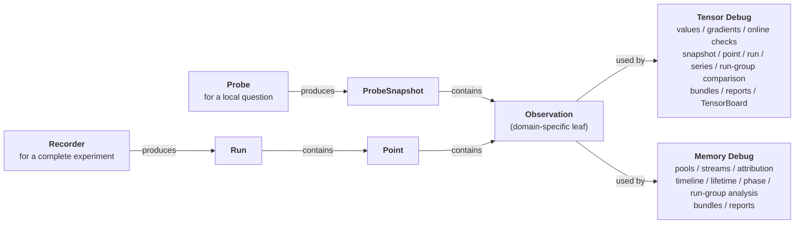

# torch-cudagraph-debug

Focused debugging tools for PyTorch CUDA Graphs:

- `tensor_debug` inserts native tensor probes and builds persisted eager or
  CUDA Graph runs for offline differential analysis.
- `memory_debug` records allocator states and analyzes default and
  non-default pools, including CUDA Graph private pools.

The package targets Linux, Python 3.10+, and CUDA-enabled PyTorch 2.6+.

## Architecture at a Glance

Tensor Debug and Memory Debug share two collection workflows:

- A `Probe` supports immediate local inspection; `snapshot()` returns a
  standalone `ProbeSnapshot` without run identity or recording-session
  lifecycle.
- A `Recorder` owns a complete experiment; `finish()` returns a `Run` with
  named `Point` objects, metadata, optional persistence, and structured
  multi-point or cross-run analysis.

Both paths use the same ownerless `Observation` model within each domain.
Choose between them based on the scope of the investigation and whether the
result needs named points or persistence.



The diagram uses shared API roles; tensor and memory provide separate concrete
types such as `TensorObservation` and `MemoryObservation`. See the
[detailed architecture](docs/architecture.md) for Collector boundaries,
ownership, and lifecycle rules.

## Install

Source installation requires CUDA-enabled PyTorch, a compatible CUDA toolkit,
and a C++17 compiler:

```bash
python -m pip install --upgrade "setuptools>=77.0.3" wheel
python -m pip install --no-build-isolation .
```

To install directly from the repository:

```bash
python -m pip install --no-build-isolation \
  "git+https://github.com/buptzyb/torch-cudagraph-debug.git@main"
```

Tensor Debug uses the native extension built during source installation.

## Tensor Quick Start

Insert a probe at intermediate tensors inside a captured dataflow. This example
uses the recommended `RecordAction` action to inspect two hidden states without
changing the graph's output:

```python
import torch

from torch_cudagraph_debug.tensor_debug import RecordAction, TensorProbe

static_x = torch.arange(8, device="cuda", dtype=torch.float32)
probe = TensorProbe("hidden", [RecordAction()])

graph = torch.cuda.CUDAGraph()
with torch.cuda.graph(graph):
    # Each probe call records one intermediate tensor in this dataflow.
    first_hidden = probe(static_x * 2, name="after_scale")
    second_hidden = probe(torch.relu(first_hidden - 5), name="after_relu")
    output = second_hidden.square()

replay_stream = torch.cuda.current_stream()
graph.replay()

# One snapshot contains every observation from the latest replay.
snapshot = probe.snapshot(synchronize=replay_stream)
for observation in snapshot.observations:
    print(
        f"replay={snapshot.replay_index} "
        f"name={observation.name} invocation={observation.invocation_index} "
        f"order={observation.order}: {observation.tensor()}"
    )
# snapshot() already waited for replay_stream.
# Destroy the graph before releasing the captured probe resources.
del graph
probe.close(synchronize=False)
```

Output:

```text
replay=1 name=after_scale invocation=0 order=0: tensor([ 0.,  2.,  4.,  6.,  8., 10., 12., 14.])
replay=1 name=after_relu invocation=0 order=1: tensor([0., 0., 0., 1., 3., 5., 7., 9.])
```

`RecordAction` is the recommended starting point. Replay the graph, then call
`snapshot()` to inspect the latest value of each named observation. Pass the
replay stream when available so the query waits only for the relevant work.
Probe calls return the original tensor unchanged, so they can be inserted
directly into the dataflow. Use probes selectively, because recording many or
large tensors adds debugging overhead.

`snapshot.observations` follows capture order. `name` identifies the observed
value, `invocation_index` distinguishes repeated observations with the same
name, `order` preserves global order, and `replay_index` identifies the replay
represented by the snapshot.

Other actions are available for targeted checks:

- `PrintAction` prints values during replay.
- `CheckAction` validates replay values against expected tensors.

Both actions add CUDA host-callback overhead, so use them only at targeted
probe sites. Multiple actions can be combined on one probe. See the Tensor
Debug guide for detailed tradeoffs.

For a one-off eager-to-CUDA-Graph check, collect independent Probe snapshots and
call `compare_snapshots()`. Use `TensorRecorder` when the investigation spans
multiple points, processes, code revisions, or devices. Recorder runs can be
saved as `.tcgd-tensor` bundles and analyzed with `compare_points()`,
`compare_runs()`, `compare_point_series()`, or `compare_run_groups()`.

See the
[standalone snapshot example](examples/tensor_debug/probe/snapshot_comparison.py)
for the quick workflow and the
[eager-vs-CUDA-Graph example](examples/tensor_debug/recorder/eager_vs_cuda_graph.py)
for the complete workflow.

Continue with the [Tensor Debug guide](docs/tensor_debug.md), the
[example learning path](examples/tensor_debug/README.md), or the
[API reference](docs/api.md#tensor-debug).

## Memory Quick Start

Take snapshots around CUDA Graph capture, then compare allocator state to see
graph-private pool growth. This lightweight Probe workflow does not require
PyTorch allocator history:

```python
import torch

from torch_cudagraph_debug.memory_debug import MemoryProbe

probe = MemoryProbe(name="graph-capture")
before_capture = probe.snapshot()

graph = torch.cuda.CUDAGraph()
with torch.cuda.graph(graph):
    # This allocation belongs to the graph's private pool.
    graph_state = torch.empty(
        16 * 1024 * 1024,
        dtype=torch.uint8,
        device="cuda",
    )
    graph_state.fill_(1)

after_capture = probe.snapshot()
growth = probe.compare(before_capture, after_capture)
print(growth.to_text(include_unchanged=False))
```

Output from the tested run:

```text
Memory comparison 'graph-capture@snapshot-0' -> 'graph-capture@snapshot-1' (same probe)
  allocator totals:
    total[all]
      allocated: 0 B -> 16.00 MiB (delta +16.00 MiB), reserved: 0 B -> 18.00 MiB (delta +18.00 MiB)
      active: 0 B -> 16.00 MiB (delta +16.00 MiB), requested: 0 B -> 16.00 MiB (delta +16.00 MiB)
      diagnostics: inactive=0 B -> 2.00 MiB (delta +2.00 MiB), fragmentation=0 B -> 1008 B (delta +1008 B), segments=0 -> 2 (delta +2), blocks=0 -> 4 (delta +4), inactive blocks=0 -> 1 (delta +1), largest inactive block=0 B -> 2.00 MiB (delta +2.00 MiB)
    total[default]
      allocated: 0 B -> 1.00 KiB (delta +1.00 KiB), reserved: 0 B -> 2.00 MiB (delta +2.00 MiB)
      active: 0 B -> 1.00 KiB (delta +1.00 KiB), requested: 0 B -> 16 B (delta +16 B)
      diagnostics: inactive=0 B -> 2.00 MiB (delta +2.00 MiB), fragmentation=0 B -> 1008 B (delta +1008 B), segments=0 -> 1 (delta +1), blocks=0 -> 3 (delta +3), inactive blocks=0 -> 1 (delta +1), largest inactive block=0 B -> 2.00 MiB (delta +2.00 MiB)
    total[private]
      allocated: 0 B -> 16.00 MiB (delta +16.00 MiB), reserved: 0 B -> 16.00 MiB (delta +16.00 MiB)
      active: 0 B -> 16.00 MiB (delta +16.00 MiB), requested: 0 B -> 16.00 MiB (delta +16.00 MiB)
      diagnostics: segments=0 -> 1 (delta +1), blocks=0 -> 1 (delta +1)
  pools:
    device[0]/pool[0,0] -> device[0]/pool[0,0] [same_probe]
      allocated: 0 B -> 1.00 KiB (delta +1.00 KiB), reserved: 0 B -> 2.00 MiB (delta +2.00 MiB)
      active: 0 B -> 1.00 KiB (delta +1.00 KiB), requested: 0 B -> 16 B (delta +16 B)
      diagnostics: inactive=0 B -> 2.00 MiB (delta +2.00 MiB), fragmentation=0 B -> 1008 B (delta +1008 B), segments=0 -> 1 (delta +1), blocks=0 -> 3 (delta +3), inactive blocks=0 -> 1 (delta +1), largest inactive block=0 B -> 2.00 MiB (delta +2.00 MiB)
      lifecycle: new segment=2.00 MiB, newly active=1.00 KiB
    device[0]/pool[1,0] -> device[0]/pool[1,0] [same_probe]
      allocated: 0 B -> 16.00 MiB (delta +16.00 MiB), reserved: 0 B -> 16.00 MiB (delta +16.00 MiB)
      active: 0 B -> 16.00 MiB (delta +16.00 MiB), requested: 0 B -> 16.00 MiB (delta +16.00 MiB)
      diagnostics: segments=0 -> 1 (delta +1), blocks=0 -> 1 (delta +1)
      lifecycle: new segment=16.00 MiB, newly active=16.00 MiB
  device/pool/stream observations:
    device[0]/pool[0,0]/stream[152349184] -> device[0]/pool[0,0]/stream[152349184] [same_probe]
      allocated: 0 B -> 1.00 KiB (delta +1.00 KiB), reserved: 0 B -> 2.00 MiB (delta +2.00 MiB)
      active: 0 B -> 1.00 KiB (delta +1.00 KiB), requested: 0 B -> 16 B (delta +16 B)
      diagnostics: inactive=0 B -> 2.00 MiB (delta +2.00 MiB), fragmentation=0 B -> 1008 B (delta +1008 B), segments=0 -> 1 (delta +1), blocks=0 -> 3 (delta +3), inactive blocks=0 -> 1 (delta +1), largest inactive block=0 B -> 2.00 MiB (delta +2.00 MiB)
      lifecycle: new segment=2.00 MiB, newly active=1.00 KiB
    device[0]/pool[1,0]/stream[152349184] -> device[0]/pool[1,0]/stream[152349184] [same_probe]
      allocated: 0 B -> 16.00 MiB (delta +16.00 MiB), reserved: 0 B -> 16.00 MiB (delta +16.00 MiB)
      active: 0 B -> 16.00 MiB (delta +16.00 MiB), requested: 0 B -> 16.00 MiB (delta +16.00 MiB)
      diagnostics: segments=0 -> 1 (delta +1), blocks=0 -> 1 (delta +1)
      lifecycle: new segment=16.00 MiB, newly active=16.00 MiB
```

Read the report top-down:

1. Every metric is `reference -> candidate (delta)`.
2. `total[all]` combines every device and pool, `total[default]` combines
   each device's `pool[0,0]`, and `total[private]` combines all non-default
   pools, including CUDA Graph pools.
3. `requested` is the original active allocation request, `allocated` is
   allocator-owned allocated space, `active` is space not yet reusable, and
   `reserved` is the full segment capacity held by the caching allocator.
4. `pools` identifies which device and pool changed;
   `device/pool/stream observations` records the state associated with each CUDA
   stream in that pool.

The main signal here is `total[private]`: graph capture added a 16 MiB active
allocation in a private pool. The small default-pool change is separate
allocator/runtime activity; this state-only report does not identify its owner.
Private-pool capacity can remain reserved after its blocks become inactive; see
the [guide](docs/memory_debug.md#interpreting-cuda-graph-private-pool-inactive-memory)
and [focused example](examples/memory_debug/probe/private_pool_inactive.py) for
the correct interpretation.

Absolute values, allocator rounding, pool and stream IDs, incidental
default-pool activity, and the changed rows that appear can vary with the
PyTorch/CUDA environment and prior allocator state.

Beyond two-point comparison, Memory Debug can:

- record a `timeline()` across named points;
- track allocation births, free requests, free completions, and survivors with
  `lifetimes()`;
- attribute growth to allocation stacks or allocator events;
- compare points and phases across runs, and summarize multi-rank run groups;
- save `.tcgd-memory` bundles for offline reports and the `tcgd-memory` CLI.

Event and lifetime attribution require complete allocator history for the
analyzed interval. Stack attribution uses available live-block frames and
reports partial coverage explicitly. State comparison, timelines, and phase
totals do not require history.
Reports can be exported as text, JSON, CSV, and HTML.

Continue with the [Memory Debug guide](docs/memory_debug.md), the
[example learning path](examples/memory_debug/README.md), the
[API reference](docs/api.md#memory-debug), or the
[`tcgd-memory` CLI reference](docs/api.md#cli).

## Agent Workflows

The repository includes a `tcgd-case-study` skill and a `tcgd-debugger` custom
agent for running fresh, evidence-backed investigations against real
applications. Both workflows start with the public Probe or Recorder APIs and
preserve commands, logs, bundles, and reports for review.

See [Agent Workflows](docs/agent_workflows.md) for Codex and Claude Code usage.

## Documentation

| Resource | Purpose |
|---|---|
| [Architecture](docs/architecture.md) | Workflow layers, shared data model, ownership, and Collector boundaries |
| [Tensor Debug guide](docs/tensor_debug.md) | Quick probes, eager/CUDA Graph runs, bundles, differential comparison, gradients, TensorBoard |
| [Memory Debug guide](docs/memory_debug.md) | Quick probes, recording, history policy, timelines, lifetimes, phases, groups, reports, CLI |
| [API reference](docs/api.md) | Public signatures, result models, errors, and experimental helpers |
| [Examples](examples/README.md) | Ordered runnable workflows and integration examples |
| [Agent workflows](docs/agent_workflows.md) | Repository-scoped case-study skill and custom-agent entry points |

## Development

See [Contributing](CONTRIBUTING.md) for development setup and checks. Release
validation is documented in [the release checklist](docs/release_checklist.md).
