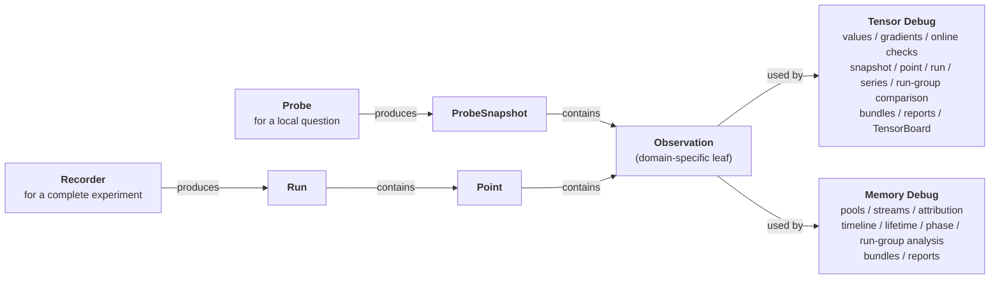

# torch-cudagraph-debug

Focused debugging tools for PyTorch CUDA Graphs:

- `tensor_debug` inserts native tensor probes and builds persisted eager or
  CUDA Graph runs for offline differential analysis.
- `memory_debug` records allocator states and analyzes default and
  non-default pools, including CUDA Graph private pools.

The package requires Linux, Python 3.10+, and CUDA-enabled PyTorch 2.6 or
newer. Memory Debug reads private PyTorch allocator interfaces whose schemas
can change between PyTorch minors; validate a new PyTorch/container combination
with the GPU compatibility gate before relying on it in production.

## Architecture at a Glance

Tensor Debug and Memory Debug share two collection workflows:

- A `Probe` supports immediate local inspection; `snapshot()` returns a
  standalone `ProbeSnapshot` without run identity or recording-session
  lifecycle.
- A `Recorder` owns a complete experiment; `finish()` returns a `Run` with
  named `Point` objects, metadata, optional persistence, and structured
  multi-point or cross-run analysis.

Both paths use the same ownerless `Observation` model within each domain.
Choose between them based on the scope of the investigation and whether the
result needs named points or persistence.



The diagram uses shared API roles; tensor and memory provide separate concrete
types such as `TensorObservation` and `MemoryObservation`. See the
[detailed architecture](docs/architecture.md) for Collector boundaries,
ownership, and lifecycle rules.

## Install

Source installation requires CUDA-enabled PyTorch, a compatible CUDA toolkit,
and a C++17 compiler:

```bash
python -m pip install --upgrade "setuptools>=77.0.3" wheel
python -m pip install --no-cache-dir --no-build-isolation .
```

To install directly from the repository, run the same `setuptools`/`wheel`
upgrade first (with `--no-build-isolation`, pip does not install the build
requirements for you):

```bash
python -m pip install --no-cache-dir --no-build-isolation \
  "git+https://github.com/buptzyb/torch-cudagraph-debug.git@main"
```

Tensor Debug uses the native extension built during source installation.

On machines without a CUDA toolchain — a laptop used for offline bundle
analysis, or a container that only needs memory diagnostics — install the
offline Tensor Debug mode:

```bash
TCGD_TENSOR_DEBUG_MODE=offline \
  python -m pip install --no-cache-dir .
```

Offline mode needs no compiler and no CUDA-enabled PyTorch at build time, and
default build isolation works — no `setuptools`/`wheel` preparation and no
`--no-build-isolation` flag are required. It disables every live Tensor Debug
workflow: enabled `TensorProbe` objects and both eager and CUDA Graph
`TensorRecorder` modes raise `LiveTensorDebugUnavailableError`. Tensor bundle
loading and comparison remain available, and Memory Debug collection and
analysis are unchanged (memory collection still requires CUDA-enabled PyTorch
at runtime).

The mode is fixed at installation time and available through
`torch_cudagraph_debug.tensor_debug_mode()`. On the first package import in
each Python process, an offline install writes one concise capability and
full-mode reinstall notice to standard error. Always pass `--no-cache-dir` for
both full and offline source installs because pip's wheel cache does not encode
the selected mode or the build-time PyTorch/CUDA ABI.

## Tensor Quick Start

Insert a probe at intermediate tensors inside a captured dataflow. This example
uses the recommended `RecordAction` to inspect two hidden states without
changing the graph's output:

```python
import torch

from torch_cudagraph_debug.tensor_debug import RecordAction, TensorProbe

static_x = torch.arange(8, device="cuda", dtype=torch.float32)
probe = TensorProbe("hidden", [RecordAction()])

graph = torch.cuda.CUDAGraph()
with torch.cuda.graph(graph):
    # Each probe call records one intermediate tensor in this dataflow.
    first_hidden = probe(static_x * 2, name="after_scale")
    second_hidden = probe(torch.relu(first_hidden - 5), name="after_relu")
    output = second_hidden.square()

replay_stream = torch.cuda.current_stream()
graph.replay()

# One snapshot contains every observation from the latest replay.
snapshot = probe.snapshot(synchronize=replay_stream)
for observation in snapshot.observations:
    print(
        f"replay={snapshot.replay_index} "
        f"name={observation.name} invocation={observation.invocation_index} "
        f"order={observation.order}: {observation.tensor()}"
    )
# snapshot() already waited for replay_stream.
# Destroy the graph before releasing the captured probe resources.
del graph
probe.close(synchronize=False)
```

Output:

```text
replay=1 name=after_scale invocation=0 order=0: tensor([ 0.,  2.,  4.,  6.,  8., 10., 12., 14.])
replay=1 name=after_relu invocation=0 order=1: tensor([0., 0., 0., 1., 3., 5., 7., 9.])
```

`RecordAction` is the recommended starting point. Replay the graph, then call
`snapshot()` to inspect the latest value of each named observation. Pass the
replay stream when available so the query waits only for the relevant work.
Probe calls return the original tensor unchanged, so they can be inserted
directly into the dataflow. Use probes selectively, because recording many or
large tensors adds debugging overhead.

`snapshot.observations` follows capture order. `name` identifies the observed
value, `invocation_index` distinguishes repeated observations with the same
name, `order` preserves global order, and `replay_index` identifies the replay
represented by the snapshot.

Other actions are available for targeted checks:

- `PrintAction` prints values during replay.
- `CheckAction` validates replay values against expected tensors.

Both actions add CUDA host-callback overhead, so use them only at targeted
probe sites. Multiple actions can be combined on one probe. See the Tensor
Debug guide for detailed tradeoffs.

For a one-off eager-to-CUDA-Graph check, collect independent Probe snapshots and
call `compare_snapshots()`. Use `TensorRecorder` when the investigation spans
multiple points, processes, code revisions, or devices. Recorder runs can be
saved as `.tcgd-tensor` bundles and analyzed with `compare_points()`,
`compare_runs()`, `compare_point_series()`, or `compare_run_groups()`.

See the
[standalone snapshot example](examples/tensor_debug/probe/snapshot_comparison.py)
for the quick workflow and the
[eager-vs-CUDA-Graph example](examples/tensor_debug/recorder/eager_vs_cuda_graph.py)
for the complete workflow.

Continue with the [Tensor Debug guide](docs/tensor_debug.md), the
[example learning path](examples/tensor_debug/README.md), or the
[API reference](docs/api.md#tensor-debug).

## Memory Quick Start

Take snapshots around CUDA Graph capture, then compare allocator state to see
graph-private pool growth. This lightweight Probe workflow does not require
PyTorch allocator history:

```python
import torch

from torch_cudagraph_debug.memory_debug import MemoryProbe

probe = MemoryProbe(name="graph-capture")
before_capture = probe.snapshot()

graph = torch.cuda.CUDAGraph()
with torch.cuda.graph(graph):
    # This allocation belongs to the graph's private pool.
    graph_state = torch.empty(
        16 * 1024 * 1024,
        dtype=torch.uint8,
        device="cuda",
    )
    graph_state.fill_(1)

after_capture = probe.snapshot()
growth = probe.compare(before_capture, after_capture)
print(growth.to_text(include_unchanged=False))
```

Representative excerpt (stream rows and sparse diagnostics elided; addresses,
pool/stream IDs, and byte values vary by environment and allocator state):

```text
Memory comparison 'graph-capture@snapshot-0' -> 'graph-capture@snapshot-1' (same probe)
  address lifecycle: exact
  CUDA scope: device-wide, includes other processes; residual = CUDA used - allocator reserved. CUDA and allocator measurements are consecutive, not atomic.

  device[0]
    CUDA used: 434.19 MiB -> 540.19 MiB (+106.00 MiB)
      residual: 434.19 MiB -> 522.19 MiB (+88.00 MiB)
      allocator:
        reserved: 0 B -> 18.00 MiB (+18.00 MiB)
        allocated: 0 B -> 16.00 MiB (+16.00 MiB), active: 0 B -> 16.00 MiB (+16.00 MiB), requested: 0 B -> 16.00 MiB (+16.00 MiB)
        pool[0,0] (default)
          reserved: 0 B -> 2.00 MiB (+2.00 MiB)
          allocated: 0 B -> 1.00 KiB (+1.00 KiB), active: 0 B -> 1.00 KiB (+1.00 KiB), requested: 0 B -> 16 B (+16 B)
          lifecycle: new segment=2.00 MiB, newly active=1.00 KiB
        pool[1,0] (private)
          reserved: 0 B -> 16.00 MiB (+16.00 MiB)
          allocated: 0 B -> 16.00 MiB (+16.00 MiB), active: 0 B -> 16.00 MiB (+16.00 MiB), requested: 0 B -> 16.00 MiB (+16.00 MiB)
          lifecycle: new segment=16.00 MiB, newly active=16.00 MiB
```

The key signal is the new `pool[1,0] (private)` subtree: capture added a 16 MiB
active allocation to a graph-private pool. Read the full report top-down:

- Values are `reference -> candidate (signed change)`.
- Levels sum: `CUDA used` (device-wide, sampled from
  `torch.cuda.mem_get_info`) splits into `residual` plus allocator `reserved`;
  `reserved` decomposes by pool and then stream.
- `residual` is device-wide evidence minus process-local allocator state: CUDA
  context and module overhead, external CUDA allocations such as NCCL buffers,
  and other processes all land there.
- `allocated`, `active`, and `requested` describe different allocator
  quantities; `lifecycle` is snapshot-based comparison, not event-backed. For
  accurate event-backed tracking, use `lifetimes()`.

The [Memory Debug guide](docs/memory_debug.md) defines every metric and report
level.

Beyond two-point comparison, Memory Debug can:

- record a `timeline()` across named points;
- track allocation births, free requests, free completions, and survivors with
  `lifetimes()`;
- attribute growth to allocation stacks or allocator events;
- compare points and phases across runs, and summarize multi-rank run groups;
- save `.tcgd-memory` bundles for offline reports and the `tcgd-memory` CLI.

Event and lifetime attribution require complete allocator event history for the
analyzed interval. Stack attribution uses available live-block frames and
reports partial coverage explicitly. State comparison, timelines, and phase
totals do not require history.
Reports can be exported as text, JSON, CSV, and HTML.

Continue with the [Memory Debug guide](docs/memory_debug.md), the
[example learning path](examples/memory_debug/README.md), the
[API reference](docs/api.md#memory-debug), or the
[`tcgd-memory` CLI reference](docs/api.md#cli).

## Agent Workflows

The repository includes a `tcgd-investigate` skill and a `tcgd-debugger` custom
agent for running fresh, evidence-backed investigations against real
applications. Both workflows start with the public Probe or Recorder APIs and
preserve commands, logs, bundles, and reports for review.

See [Agent Workflows](docs/agent_workflows.md) for Codex and Claude Code usage.

## Documentation

| Resource | Purpose |
|---|---|
| [Architecture](docs/architecture.md) | Workflow layers, shared data model, ownership, and Collector boundaries |
| [Tensor Debug guide](docs/tensor_debug.md) | Quick probes, eager/CUDA Graph runs, bundles, differential comparison, gradients, TensorBoard |
| [Memory Debug guide](docs/memory_debug.md) | Quick probes, recording, history policy, timelines, lifetimes, phases, groups, reports, CLI |
| [API reference](docs/api.md) | Public signatures, result models, errors, and experimental helpers |
| [Examples](examples/README.md) | Ordered runnable workflows and integration examples |
| [Agent workflows](docs/agent_workflows.md) | Repository-scoped investigation skill and custom-agent entry points |

## Development

See [Contributing](CONTRIBUTING.md) for development setup and checks. Release
validation is documented in [the release checklist](docs/release_checklist.md).
