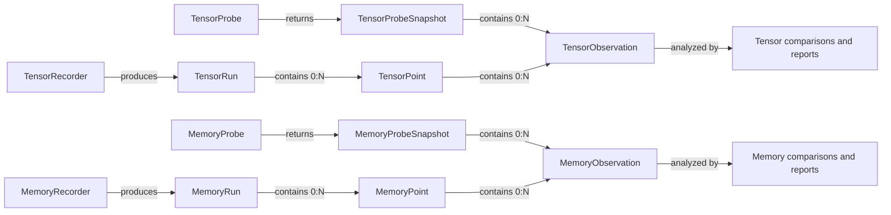
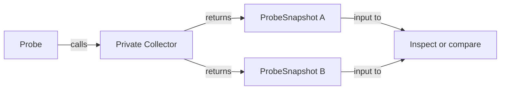
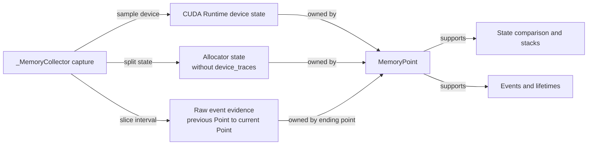

# Debug Architecture

> Status: implemented public architecture. Class names in the diagrams map to
> the current Python code; private Collector types are implementation details.

The tensor and memory APIs provide two public workflows over domain-specific
collection code:

- A **Probe** is the low-ceremony entry point for local, immediate observation.
  It returns standalone snapshots and does not create a run or bundle.
- A **Recorder** coordinates a complete recording session. It names points,
  records metadata, optionally persists a bundle, and produces a `Run` for
  structured analysis.
- A private **Collector** acquires the underlying data. Probe and Recorder are
  sibling clients of the Collector; Recorder does not instantiate or depend on
  the public Probe object.

"Quick" describes the amount of workflow ceremony, not the runtime cost.
Tensor copies, host callbacks, and allocator snapshots can all be expensive.

## Component Relationships

## Shared Observation Model

The workflows use different containers but converge on the same domain leaf:

An Observation has no `probe_id`, `run_id`, point index, replay index, label,
or timestamp. Those ownership and ordering fields live on `ProbeSnapshot` or
`Point`. This lets Probe and Recorder reuse the same immutable leaf model
without pretending a standalone snapshot belongs to a run.

Every Probe snapshot has a Probe-local `snapshot_index` that orders host
queries. Tensor snapshots additionally carry the GPU `replay_index` that
identifies which graph replay supplied their values. Recorder Points use labels
and indices; CUDA Graph TensorPoints may also retain replay evidence.

`SnapshotComparison` and `PointComparison` are sibling public result types in
both domains. They share private state-comparison behavior, but direct Probe
comparison consumes the observations contained by a `ProbeSnapshot` directly;
it never constructs a synthetic Point or Run. Memory lifetime reports identify
their real source with `source_kind`, `source_id`, and `source_name`.

The leaf data has domain-specific meaning:

- A tensor observation identifies one named probe invocation and its tensor
  payload or summary.
- A memory observation identifies one `(device_index, pool_id, stream)` state
  within a point-in-time allocator snapshot. Pool and allocator-scope totals are
  derived views rather than separate observation types.

## Quick Workflow

The Probe path deliberately omits run identity and persistence:

Probe snapshots may be retained and compared directly, but they do not carry a
`run_id`, point label, bundle path, or recording-session lifecycle. Use a
Recorder when those capabilities are needed.

## Lifecycle Rules

A Recorder has one terminal result. Normal `finish()` or normal context exit
sets `complete=True`. Exceptional context exit preserves collected points,
sets `finished_at`, persists `complete=False`, and freezes further collection;
it does not relabel a partial investigation as complete. `preview()` is a
nonterminal view before exit and returns the terminal result afterward.
Terminal Runs require `finished_at`; timestamps cannot precede creation, follow
completion, or move backward across Points. Public constructors enforce the same
identity and time contract as bundle loaders.

Tensor collectors own CUDA-visible storage. `snapshot()`, status queries, and
`close()` accept the same bool/stream/device synchronization contract.
Capture-only collection determines capture state on the collector's configured
device before validating the source tensor. Calls outside capture remain
transparent no-ops; active capture requires a CUDA tensor on that same device.
Closing an enabled collector is invalid during capture and is valid only after
every graph that references the collector can no longer replay.
Captured callback payload addresses remain stable for the graph lifetime;
eager callback payloads are destroyed when they fire. `when="always"` eager
collection is single-stream. Each eager observation name owns one stable slot,
and repeated samples update that slot in place. Host-side slot preparation uses
a two-phase transaction: failures before CUDA submission restore the prior slot
layout and capture order. The first successful capture replaces the eager name
layout with the graph's capture-call layout. Pre-capture staging becomes retired
state and is reclaimed only after its eager copy or callback completion is
observed. A failure after CUDA submission begins makes the collector unusable
for further collection or queries, while preserving `close()` for cleanup.
Eager use is rejected after the collector has participated in capture.
A Tensor Recorder commits its per-name capture invocation index only after the
private collector accepts the slot, preserving retry identity after host-side
failure; eager observations consume their index before staging runs.

Memory collectors have no persistent native graph resources to close. Probe and
Recorder semantics are expressed by immutable snapshots and terminal runs
instead. Memory collection is device-aware: device index is part of pool and
observation identity, and one Probe or Recorder may select one device, a device
sequence, or all visible devices.

Each memory capture also attempts one `torch.cuda.mem_get_info` sample per
selected device immediately after `_snapshot()` and before CPU normalization.
The calls are consecutive but not atomic. Sampling is attempted during CUDA
Graph capture without synchronization; a per-device failure becomes a warning.
Device samples live directly on `MemoryProbeSnapshot` and `MemoryPoint`, not in
`MemoryObservation`, because they describe device-global CUDA Runtime capacity
rather than one allocator pool/stream leaf.

## Memory State And Event Evidence

A memory collection starts from one private PyTorch `_snapshot()` call, but the
Recorder does not retain that cumulative payload as a Point:

Every `MemoryPoint` owns one allocator state. After the first point, it also
owns the internal event evidence for the interval ending at that point. There is
no public event-evidence interval object (`MemoryRange` is a view over two
points, not an event container): a same-run range reads the ending points whose
event chunks it crosses. Probe snapshots retain their complete in-memory raw snapshot
for low-level local inspection and derive `allocator_state()` from it.

Persisted runs mirror this ownership with `states/NNNN.json.gz` and
`events/NNNN-NNNN.json.gz`. Their SHA-256 values live in the point manifest,
beside compact derived observations. Manifest-only summaries and timelines do
not read payloads. First raw-state access verifies the digest and recomputes
observations to reject cache/source disagreement; `MemoryRun.validate_payloads()`
bypasses lazy caches and rereads every persisted state and event payload.
Ordinary access keeps separate lazy caches, so state-only attribution loads
only endpoint states and event or lifetime analysis loads only crossed event
chunks. Event entries remain raw until attribution recognizes them.

Per-device event evidence has one internal status: `complete`, `disabled`,
`boundary_unavailable`, `truncated`, or `invalid_boundary_order`. The status is
recorded at collection time, while public analysis raises the corresponding
typed error only when the caller requests evidence crossing that interval. A
truncated interval does not invalidate its point-in-time allocator states.
Recorder intervals use the ending snapshot's trace end because that snapshot's
own marker is normally absent from its returned trace. A `complete` interval
therefore assumes the application kept allocator history enabled continuously;
the metadata API confirms setup, not history continuity.

Lifetime replay tracks each allocation generation by its exact device and
address. A generation created by an `alloc` event is provisional until its
first endpoint snapshot: the event supplies the requested size, while the
snapshot confirms the allocator-rounded block size and may fill an unknown
pool, stream, or allocation stack. Once snapshot-confirmed, rounded size,
requested size, known pool and stream, and a nonempty snapshot allocation stack
must remain stable until `free_completed`; otherwise the complete event window
and endpoint state contradict each other. Snapshot-internal duplicate active
addresses and duplicate `free_requested` transitions are contradictions too.
This distinction preserves legitimate event-to-block rounding without treating
an unwitnessed generation change as the same allocation.

## Architectural Boundaries

1. Probe and Recorder are sibling public entry points over a private,
   domain-specific collection layer. Memory shares `_MemoryCollector` directly;
   tensor CUDA Graph collection shares `_TensorCollector`, while eager Recorder
   collection uses `_EagerTensorCollector`.
2. Recorder does not instantiate the public Probe API. Shared behavior belongs
   in the private collection layer.
3. Probe returns standalone `ProbeSnapshot` values; Recorder produces `Run`
   values. A Run contains Points, while ProbeSnapshot and Point both contain
   ownerless Observations. Both domains can group rank-local Runs without
   merging rank identity.
4. Tensor and memory Collectors have matching responsibilities but no synthetic
   common base class. Their execution and synchronization mechanisms remain
   domain-specific.
5. Snapshot comparison and Point comparison share private algorithms only. A
   Probe identity is never stored in a `run_id`, and a Probe snapshot is never
   wrapped in a synthetic Point or Run.
