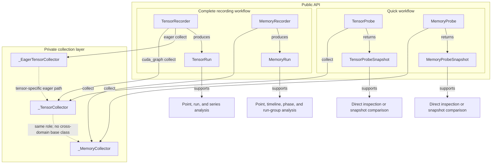
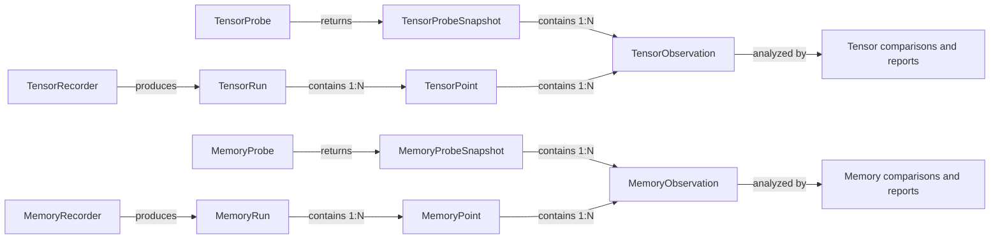
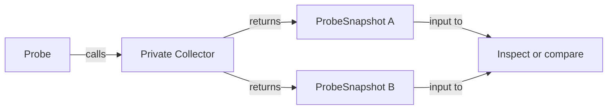

# Debug Architecture

> Status: implemented public architecture. Class names in the diagrams map to
> the current Python code; private Collector types are implementation details.

The tensor and memory APIs provide two public workflows over domain-specific
collection code:

- A **Probe** is the low-ceremony entry point for local, immediate observation.
  It returns standalone snapshots and does not create a run or bundle.
- A **Recorder** coordinates a complete recording session. It names points,
  records metadata, optionally persists a bundle, and produces a `Run` for
  structured analysis.
- A private **Collector** acquires the underlying data. Probe and Recorder are
  sibling clients of the Collector; Recorder does not instantiate or depend on
  the public Probe object.

"Quick" describes the amount of workflow ceremony, not the runtime cost.
Tensor copies, host callbacks, and allocator snapshots can all be expensive.

## Component Relationships

## Shared Observation Model

The workflows use different containers but converge on the same domain leaf:

An Observation has no `probe_id`, `run_id`, point index, replay index, label,
or timestamp. Those ownership and ordering fields live on `ProbeSnapshot` or
`Point`. This lets Probe and Recorder reuse the same immutable leaf model
without pretending a standalone snapshot belongs to a run.

`SnapshotComparison` and `PointComparison` are sibling public result types in
both domains. They share private state-comparison behavior, but direct Probe
comparison consumes the observations contained by a `ProbeSnapshot` directly;
it never constructs a synthetic Point or Run. Memory lifetime reports identify
their real source with `source_kind`, `source_id`, and `source_name`.

The leaf data has domain-specific meaning:

- A tensor observation identifies one named probe invocation and its tensor
  payload or summary.
- A memory observation identifies one allocator scope, such as a pool and
  stream, within a point-in-time allocator snapshot.

## Quick Workflow

The Probe path deliberately omits run identity and persistence:

Probe snapshots may be retained and compared directly, but they do not carry a
`run_id`, point label, bundle path, or recording-session lifecycle. Use a
Recorder when those capabilities are needed.

## Lifecycle Rules

A Recorder has one terminal result. Normal `finish()` or normal context exit
sets `complete=True`. Exceptional context exit preserves collected points,
sets `finished_at`, persists `complete=False`, and freezes further collection;
it does not relabel a partial investigation as complete. `snapshot_run()` is a
nonterminal view before exit and returns the terminal result afterward.

Tensor collectors own CUDA-visible storage. `snapshot()`, status queries, and
`close()` accept the same bool/stream/device synchronization contract.
Closing an enabled collector is invalid during capture and is valid only after
every graph that references the collector can no longer replay.
Captured callback payload addresses remain stable for the graph lifetime;
eager callback payloads are destroyed when they fire. `when="always"` eager
collection is single-stream, and eager use is rejected after that collector has
participated in capture.

Memory collectors have no persistent native graph resources to close. Their
Probe and Recorder semantics are expressed by immutable snapshots and terminal
runs instead.

## Architectural Boundaries

1. Probe and Recorder are sibling public entry points over a private,
   domain-specific collection layer. Memory shares `_MemoryCollector` directly;
   tensor CUDA Graph collection shares `_TensorCollector`, while eager Recorder
   collection uses `_EagerTensorCollector`.
2. Recorder does not instantiate the public Probe API. Shared behavior belongs
   in the private collection layer.
3. Probe returns standalone `ProbeSnapshot` values; Recorder produces `Run`
   values. A Run contains Points, while ProbeSnapshot and Point both contain
   ownerless Observations.
4. Tensor and memory Collectors have matching responsibilities but no synthetic
   common base class. Their execution and synchronization mechanisms remain
   domain-specific.
5. Snapshot comparison and Point comparison share private algorithms only. A
   Probe identity is never stored in a `run_id`, and a Probe snapshot is never
   wrapped in a synthetic Point or Run.
